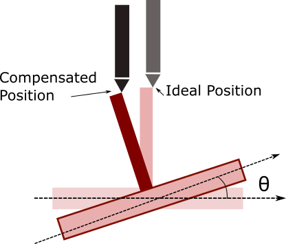

# printer-tilt-compensation

3D printer bed surfaces can get a tilt during shipping or after some use.This makes the
print unable to stick to the surface. Classically, it requires the users to frequently level
their print bed to eliminate this tilt, using the levelling screws. However,to increase the
ease of use, the idea is to to automatically compensate for this tilt to have fault-free
prints with no user maintenance required.

This repository contains a C# algorithm in order to compensate the printer tilt based on the the measurement of three points in the bed surface.

  

Based on this three points measured in the surface of the bed, an Homogeneous Transformation matrix is calculated. This consist of two matrices, a Rotation and a Translation Matrix, these are use to model the rotation and translation of the bed due to minor tilts that may happen during the manufacturing or shipment of the 3D printer.  

  

Then the transformation matrix is multiply by ideal coordinate of the end effector of the printer (if there was no tilt) to obtain the corrected printing position, avoiding imprecisions.
