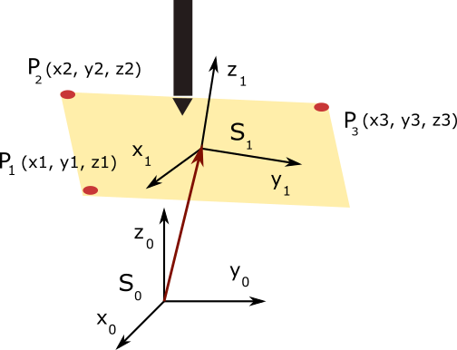

# printer-tilt-compensation

3D printer bed surfaces can get a tilt during shipping or after some use.This makes the
print unable to stick to the surface. Classically, it requires the users to frequently level
their print bed to eliminate this tilt,using the levelling screws. However,to increase the
ease of use, the idea is to to automatically compensate for this tilt to have fault-free
prints with no user maintenance required.

This repository contains a C# algorithm in order to compensate the printer tilt based on the the measurement of three points in the bed surface

Based on this three points a Transformation matrix is calculated to correct the printing position, avoiding imprecition in the 3D printing.